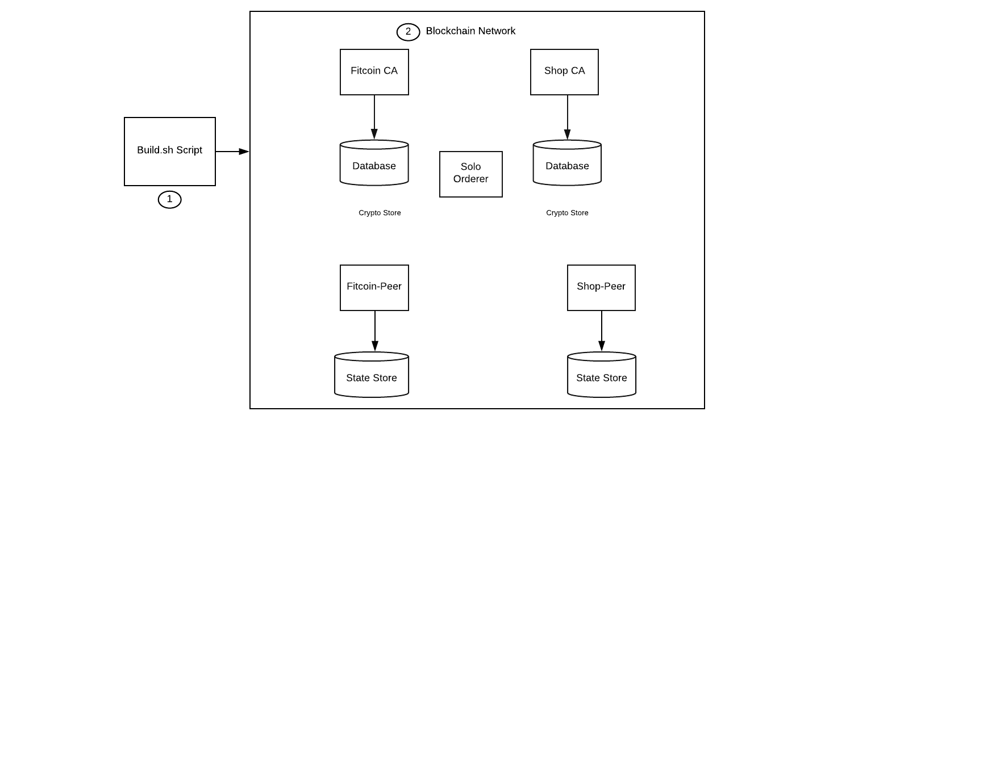

# Hyperledger Fabric Node SDK을 이용한 블록체인 네트워크의 생성과 배포

## 블록체인 네트워크 설정하기

블록체인 응용 프로그램 구축하기 파트1에 오신 것을 환영합니다.
이 첫 번째 패턴은 블록체인을 백엔드로 사용하여 피트니스 활동을 기록하고 fitcoin을 통한 제품의 주문 처리와 같은 트랜잭션을 관리하는 대형 애플리케이션의 일부입니다.
이 시리즈의 첫 번째 단계는 Hyperledger Fabric Node SDK를 사용하여 Hyperledger 블록체인 네트워크를 만들고 배포하는 데 중점을 둡니다.
우리는 두 명의 참가자, 즉 구매자 그리고 판매자/상점 피어가 있습니다. 구매자는 응용 프로그램을 다운로드 한 후 자신의 단계를 블록체인에 등록합니다.
판매자는 구매자가 구매를 하기에 충분한 fitcoin을 가지고 있는지 확인합니다.

lite 계정을 가진 개발자는 이 애플리케이션을 로컬에서 실행하거나 [IBM Blockchain Starter Plan](https://www.ibm.com/blogs/blockchain/2018/03/getting-started-on-the-ibm-blockchain-platform-starter-plan/)을 참조합니다.

## Included Components
* Hyperledger Fabric
* Docker
* Hyperledger Fabric SDK for node.js


## Application Workflow Diagram


## Prerequisites
* [Docker](https://www.docker.com/products/overview) - v1.13 or higher
* [Docker Compose](https://docs.docker.com/compose/overview/) - v1.8 or higher

## Steps
1. [Run Build.sh Script to build network](#1-run-the-build.sh-script)
2. [Start the Network](#2-start-the-network)
3. [Check the logs to see the results](#3-check-the-logs)
4. [Check the Blockchain Network](#4-check-the-blockchainnetwork)

## 1. Run the Build.sh Script
This accomplishes the following:

a. Clean up system by removing any existing blockchain docker images

b. Generate certificates

  * The `crypto-config.yaml` (Crypto configuration file) defines the identity of "who is who". It tells peers and orderers what organization they belong to and what domain they belong to.

c.  Create Peers, Orderers and Channel

  * The `configtx.yaml` file initializes a blockchain network or channel and services with an Orderer Genesis Block which serves as the first block on a chain. Additionally, membership services are installed on each channel peer (in this case, the Shop and Fitcoin Peers).

d. Build docker images of the orderer, peers, channel, network

### Open a new terminal and run the following command:
```bash
export FABRIC_CFG_PATH=$(pwd)
chmod +x cryptogen
chmod +x configtxgen
chmod +x generate-certs.sh
chmod +x generate-cfgtx.sh
chmod +x docker-images.sh
chmod +x build.sh
chmod +x clean.sh
./build.sh
```

## 2. Start the Network

Make sure the 'LOCALCONFIG' environment variable is unset if you are re-running this step after running the test below
```bash
unset LOCALCONFIG  
```

There 2 options to install chaincode on the peer nodes and start the Blockchain network. You can select any one of the following:
* Using LevelDB to store the blockchain state database. Run the following command to start the network:
```bash
docker-compose -p "fitcoin" -f "docker-compose.yaml" up -d    
```
* Using CouchDB to store the blockchain state database. Run the following command to start the network:
```bash
docker-compose -p "fitcoin" -f "docker-compose-couchdb.yaml" up -d    
```

## 3. Check the logs

You will see the results of running the script

**Command**
```bash
docker logs blockchain-setup
```
**Output:**
```bash
Register CA fitcoin-org
CA registration complete  FabricCAServices : {hostname: fitcoin-ca, port: 7054}
Register CA shop-org
CA registration complete  FabricCAServices : {hostname: shop-ca, port: 7054}
info: [EventHub.js]: _connect - options {"grpc.ssl_target_name_override":"shop-peer","grpc.default_authority":"shop-peer"}
info: [EventHub.js]: _connect - options {"grpc.ssl_target_name_override":"fitcoin-peer","grpc.default_authority":"fitcoin-peer"}
Default channel not found, attempting creation...
Successfully created a new default channel.
Joining peers to the default channel.
Chaincode is not installed, attempting installation...
Base container image present.
info: [packager/Golang.js]: packaging GOLANG from bcfit
info: [packager/Golang.js]: packaging GOLANG from bcfit
Successfully installed chaincode on the default channel.
Successfully instantiated chaincode on all peers.
```


## 4.  Check the BlockchainNetwork

Execute the following commands to to test the network by performing the `invoke` and `query` operations on the network:
```bash
cd configuration
export LOCALCONFIG=true
node config.js
cd ..
cd test/
npm install
```

If you are using LevelDB, then run the following command:
```bash
node index.js
```

If you are using CouchDB, then run the following command:
```bash
node indexCouchDB.js
```


## Additional Resources
* [Hyperledger Fabric Documentation](https://hyperledger-fabric.readthedocs.io/en/release-1.1/)
* [Hyperledger Fabric code on GitHub](https://github.com/hyperledger/fabric)

## License
[Apache 2.0](LICENSE)
